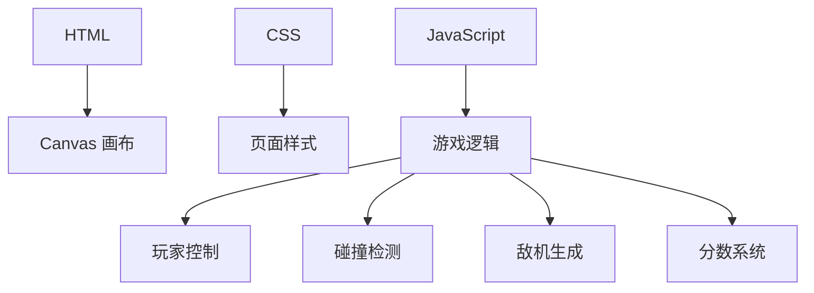

## 1. Architecture Design
使用纯前端技术栈实现 2D Canvas 飞机大战游戏，无需后端服务。

## 2. Technology Description
- 前端：HTML5 + CSS3 + JavaScript (ES6+)
- 游戏渲染：HTML5 Canvas
- 无需后端和数据库

## 3. Route Definitions
单页应用，无路由需求。

## 4. API Definitions
无需 API。

## 5. Server Architecture Diagram
无需后端服务。

## 6. Data Model
无需数据模型，游戏状态全部在前端内存中管理。
