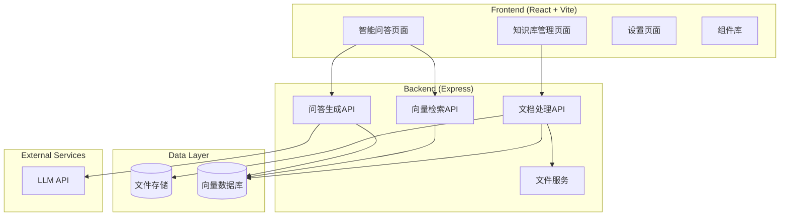
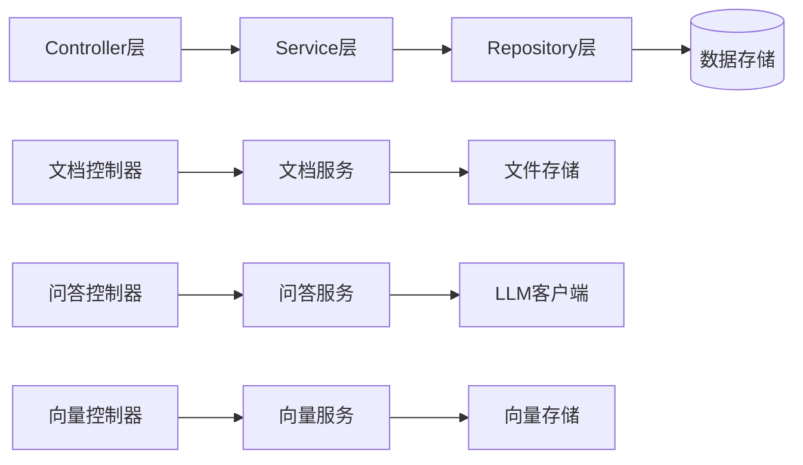
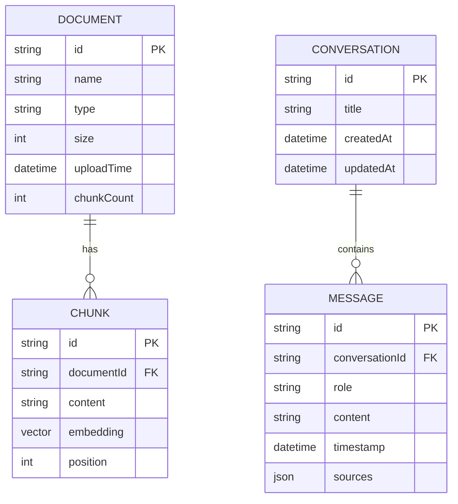

## 1. Architecture Design


## 2. Technology Description
- **Frontend**: React@18 + TypeScript + TailwindCSS@3 + Vite + Zustand
- **Initialization Tool**: vite-init
- **Backend**: Express@4 + TypeScript
- **Vector Database**: LangChain + Memory Vector Store (本地)
- **LLM Integration**: OpenAI API兼容接口
- **Document Parsing**: pdf-parse, mammoth, markdown-it

## 3. Route Definitions
| Route | Purpose |
|-------|---------|
| / | 智能问答页面 |
| /knowledge | 知识库管理页面 |
| /settings | 设置页面 |

## 4. API Definitions
```typescript
// API接口定义
interface Document {
  id: string;
  name: string;
  type: 'pdf' | 'txt' | 'md' | 'docx';
  size: number;
  uploadTime: Date;
  chunkCount: number;
}

interface Message {
  id: string;
  role: 'user' | 'assistant';
  content: string;
  sources?: Source[];
  timestamp: Date;
}

interface Source {
  documentId: string;
  documentName: string;
  content: string;
  score: number;
}

// API响应类型
interface UploadResponse {
  success: boolean;
  document: Document;
}

interface ChatRequest {
  question: string;
  history: Message[];
}

interface ChatResponse {
  answer: string;
  sources: Source[];
}
```

## 5. Server Architecture Diagram


## 6. Data Model
### 6.1 Data Model Definition


### 6.2 Data Definition Language
```typescript
// 使用内存存储的数据结构定义
interface DocumentStore {
  documents: Map<string, Document>;
  chunks: Map<string, Chunk>;
  conversations: Map<string, Conversation>;
  messages: Map<string, Message[]>;
}

// 向量存储使用LangChain MemoryVectorStore
```
