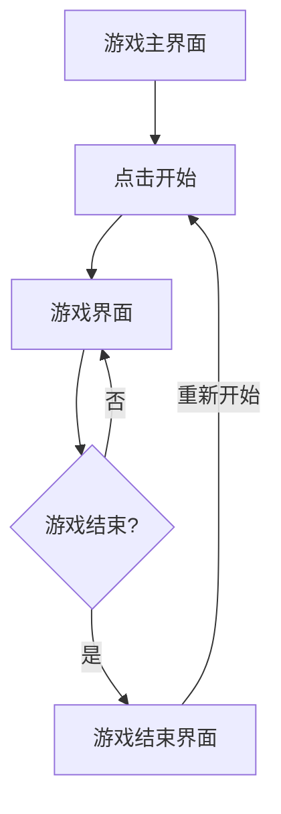

## 1. Product Overview
飞机大战是一款经典的射击小游戏，玩家操控飞机发射子弹击毁敌机，获得分数。适合所有年龄段用户，提供简单有趣的休闲娱乐体验。

## 2. Core Features

### 2.1 User Roles
无需用户角色，所有用户直接进入游戏。

### 2.2 Feature Module
1. **游戏主界面**：游戏画布、开始按钮、分数显示
2. **游戏界面**：玩家飞机、敌机、子弹、碰撞检测、分数系统
3. **游戏结束界面**：最终分数、重新开始按钮

### 2.3 Page Details
| Page Name | Module Name | Feature description |
|-----------|-------------|---------------------|
| 游戏主界面 | 开始按钮 | 点击开始游戏 |
| 游戏主界面 | 标题 | 显示游戏名称 |
| 游戏界面 | 玩家控制 | 使用鼠标或键盘方向键控制飞机移动 |
| 游戏界面 | 射击系统 | 自动发射子弹或按键发射 |
| 游戏界面 | 敌机生成 | 随机生成敌机从屏幕顶部飞出 |
| 游戏界面 | 碰撞检测 | 检测子弹击中敌机和敌机撞上玩家飞机 |
| 游戏界面 | 分数显示 | 实时显示当前分数 |
| 游戏结束界面 | 最终分数 | 显示游戏结束时的分数 |
| 游戏结束界面 | 重新开始 | 点击重新开始游戏 |

## 3. Core Process
用户进入游戏 → 点击开始按钮 → 控制飞机移动 → 射击敌机 → 获得分数 → 游戏结束 → 点击重新开始

## 4. User Interface Design
### 4.1 Design Style
- 主色调：深蓝色、天蓝色、亮黄色
- 按钮风格：圆角、渐变、悬停效果
- 字体：Arial, sans-serif，大号标题、中号分数显示
- 布局风格：居中画布，简洁设计
- 图标：使用游戏元素图标

### 4.2 Page Design Overview
| Page Name | Module Name | UI Elements |
|-----------|-------------|-------------|
| 游戏主界面 | 标题 | 居中、大号字体、发光效果 |
| 游戏主界面 | 开始按钮 | 居中、圆角、渐变背景、悬停放大 |
| 游戏界面 | 游戏画布 | 深色太空背景、星星效果 |
| 游戏界面 | 分数显示 | 右上角、白色字体 |
| 游戏结束界面 | 游戏结束文字 | 居中、红色大号字体 |
| 游戏结束界面 | 最终分数 | 居中、黄色字体 |
| 游戏结束界面 | 重新开始按钮 | 与开始按钮相同风格 |

### 4.3 Responsiveness
桌面端优化，支持键盘和鼠标操作。

### 4.4 3D Scene Guidance
不适用，使用 2D Canvas 游戏。
