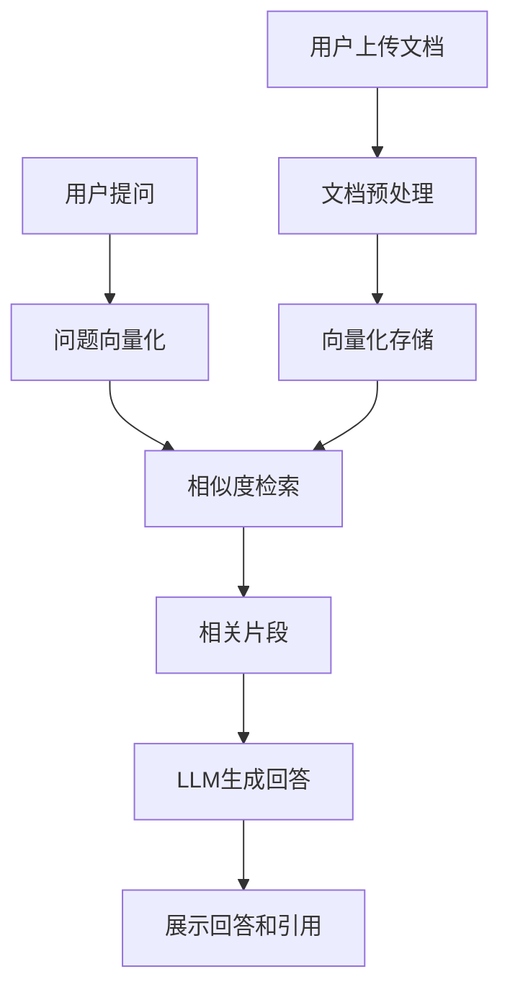

## 1. Product Overview
基于本地或私有知识库的智能问答助手，使用自然语言提问从知识库检索相关信息并生成有据可循的回答。
- 主要解决用户需要基于特定文档集合进行精准问答的问题
- 目标用户包括个人知识管理、企业文档问答和教学辅助场景

## 2. Core Features

### 2.1 User Roles
| Role | Registration Method | Core Permissions |
|------|---------------------|------------------|
| 普通用户 | 无需注册上传文档 | 上传文档、管理知识库、智能问答 |

### 2.2 Feature Module
1. **知识库管理页面**：文档上传、文档列表、知识库状态
2. **智能问答页面**：提问输入、对话历史、回答展示、引用来源
3. **设置页面**：系统配置、模型参数

### 2.3 Page Details
| Page Name | Module Name | Feature description |
|-----------|-------------|---------------------|
| 知识库管理 | 文档上传区 | 支持拖拽上传PDF、TXT、Markdown等格式文档 |
| 知识库管理 | 文档列表 | 显示已上传文档、删除文档、查看文档详情 |
| 智能问答 | 对话界面 | 多轮对话、实时生成回答、显示引用来源 |
| 智能问答 | 搜索增强 | 支持检索相关文档片段 |

## 3. Core Process
用户上传文档到知识库 → 系统对文档进行向量化处理 → 用户输入问题 → 系统从知识库检索相关片段 → 结合大语言模型生成回答 → 展示回答及引用来源

## 4. User Interface Design
### 4.1 Design Style
- **主色调**：深蓝(#1e3a8a)配合青色(#06b6d4)点缀
- **按钮风格**：圆角设计，平滑过渡动画
- **字体**：使用Geist Sans作为主体字体，Geist Mono用于代码展示
- **布局风格**：左侧边栏导航，主内容区域自适应
- **图标风格**：使用Lucide图标库，线性简约风格

### 4.2 Page Design Overview
| Page Name | Module Name | UI Elements |
|-----------|-------------|-------------|
| 知识库管理 | 上传区域 | 深蓝色卡片背景，渐变边框，拖拽感应高亮 |
| 智能问答 | 对话区域 | 聊天气泡设计，用户消息居右，系统回答居左，引用标记醒目 |
| 导航栏 | 侧边栏 | 半透明毛玻璃效果，平滑过渡动画 |

### 4.3 Responsiveness
Desktop-first设计，支持平板和手机自适应布局，触摸操作优化

### 4.4 3D Scene Guidance
不适用
